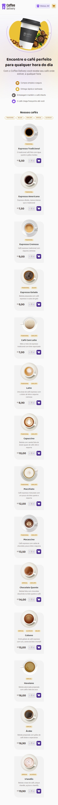
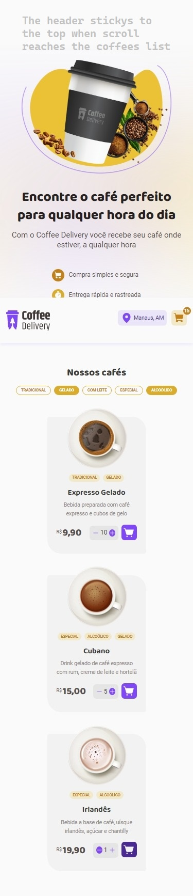
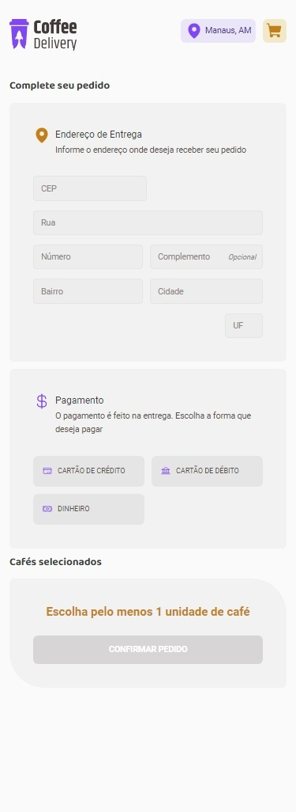
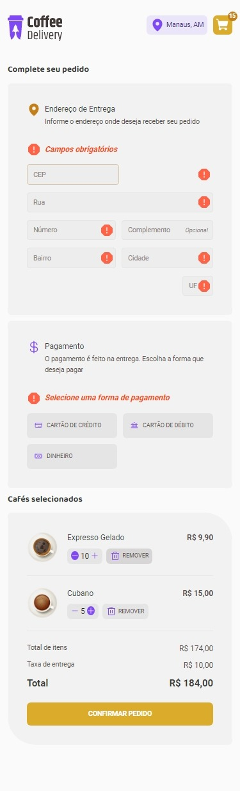
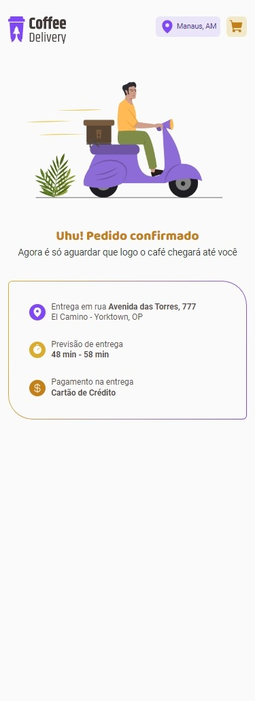
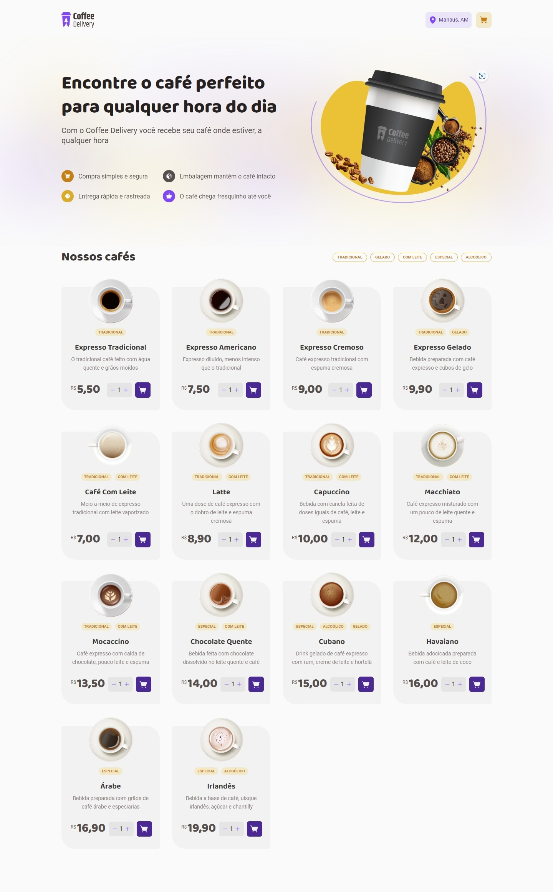
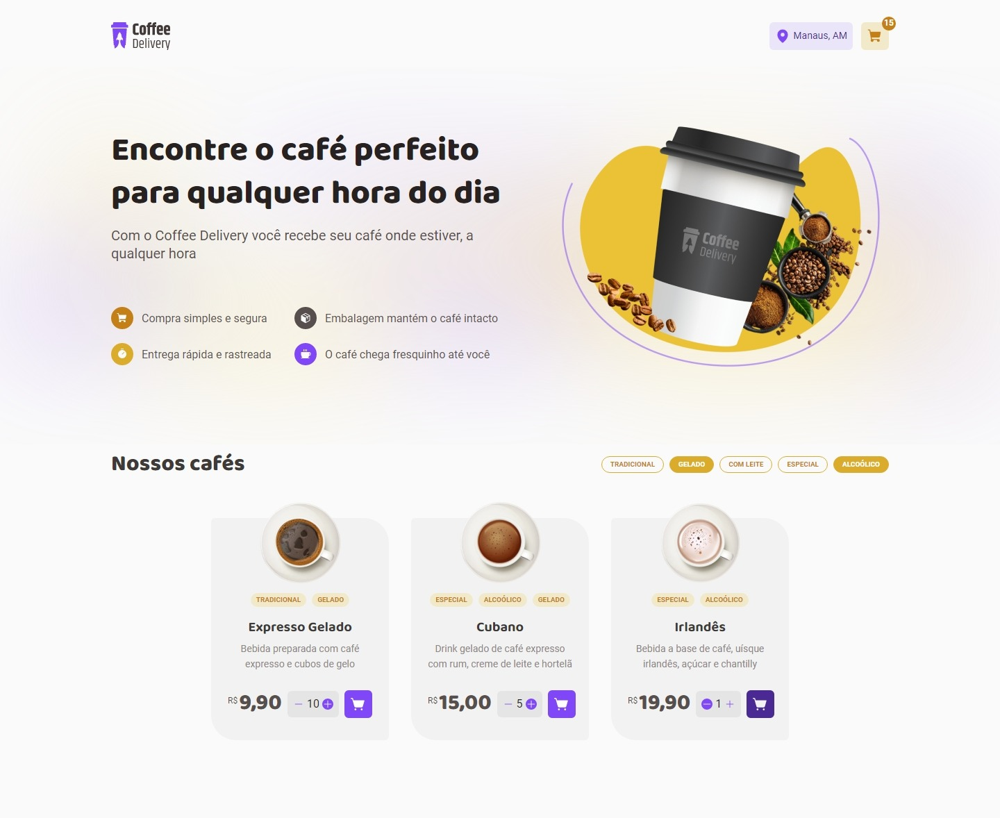
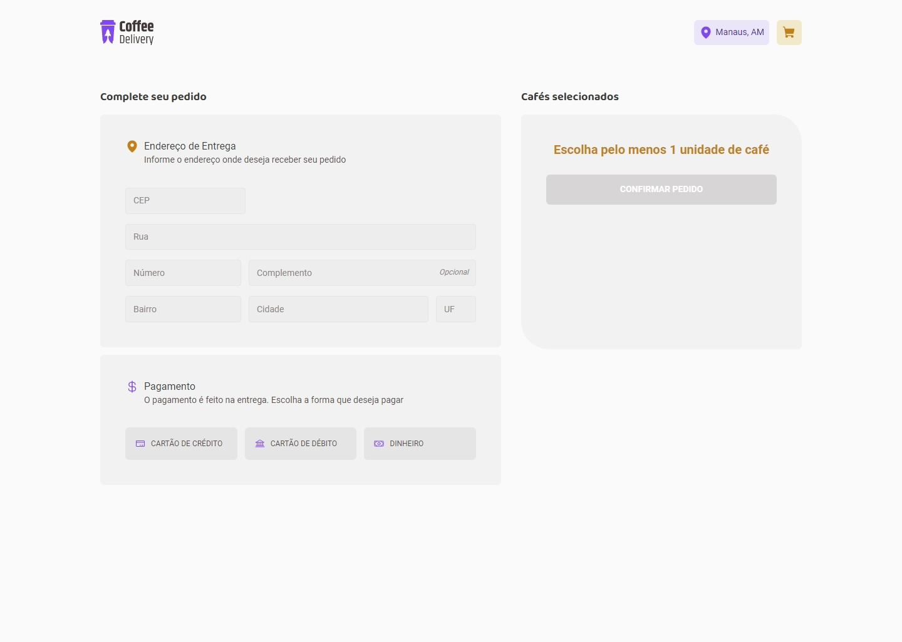
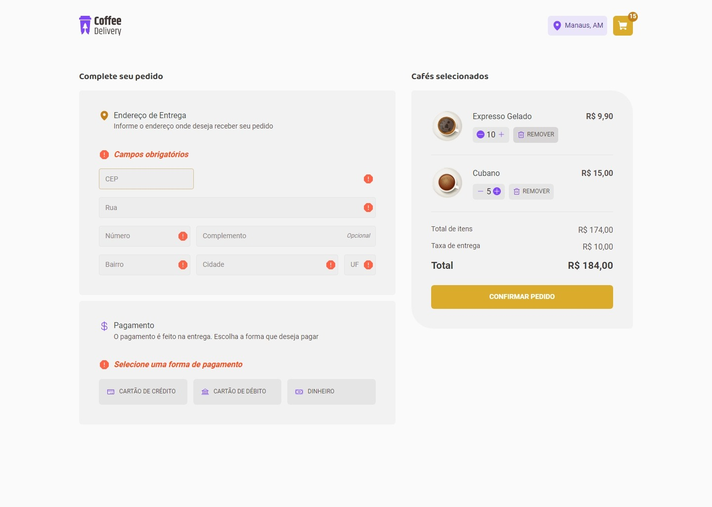
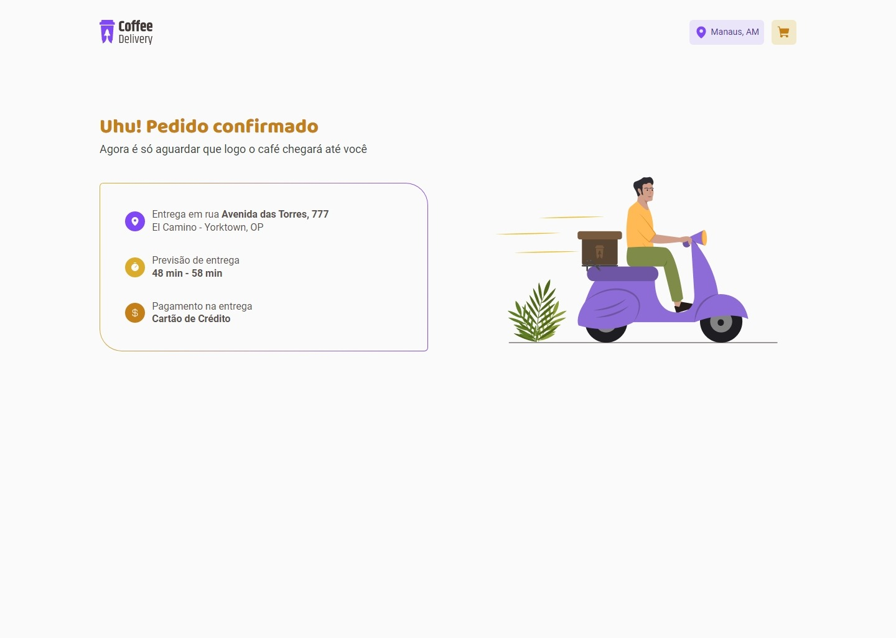

# Desafio 02 - Coffee Delivery

O segundo desafio da trilha atualizada de ReactJS do *bootcamp* Ignite da [Rocketseat](https://www.rocketseat.com.br/) exige que o aluno desenvolva uma aplicação frontend aplicando diversos conceitos de React e de ferramentas do seu ecossistema.

## Table of contents

- [Overview](#overview)
  - [The challenge](#the-challenge)
  - [Screenshot](#screenshot)
  - [Links](#links)
- [My process](#my-process)
  - [Built with](#built-with)
  - [What I learned](#what-i-learned)
  - [Questions](#questions)
  - [Useful resources](#useful-resources)
- [Author](#author)

## Overview

Coffee Delivery foi o aplicativo desenvolvido para completar o desafio do módulo 2, cuja principal funcionalidade é compra de cafés de uma cafeteria fictícia. Na tela principal, o usuário pode selecionar quantidades de diferentes tipos de cafés; na tela de *checkout*, ele preenche um formulário de endereço e pagamento e também visualiza um resumo da compra; por fim, na tela final é apresentada as informações de entrega.

### The challenge

A proposta deste desafio é construir um aplicativo utilizando os conceitos de React e suas bibliotecas apresentadas nas aulas do módulo 2, seguindo a proposta de design disponibilizada [neste projeto Figma](https://www.figma.com/file/5yT9ZzZmRQRS4yivGGB3pl/Coffee-Delivery/).

#### Design

- ✔️ Aplicação correta de fontes, cores, tamanhos, espaçamentos, ilustrações, ícones e textos;
- ✔️ Reação de botões e campos a ações de *hover over* e *focus*;
- ✔️ Transições entre estados (bônus);
- ✔️ Responsividade entre 320px e 1440px (bônus).

#### Funcionalidades

- ✔️ Listar produtos (cafés) disponíveis paracompra;
- ✔️ Adição de quantidades específicas dediferentes cafés no carrinho;
- ✔️ Incremento e decremento da quantidade deitens do carrinho;
- ✔️ Formulários para fornecimento de dados;
- ✔️ Exibição do total de itens do carrinho no*header*;
- ✔️ Exibição do valor total a pagar;
- ✔️ Filtragem de produtos na tela principal(bônus);
- ✔️ Mensagem de carrinho vazio (bônus);
- ✔️ Apresentação de mensagens de validação nos formulários (bônus).

### Screenshot

Capturas de tela do app desenvolvido para dispositivos mobile (375px) e desktop (1440px).

#### Mobile

|   Home   |  Home (active)  |  Checkout  | Checkout (active) | Success |
|  :----:  |      :----:     |    :---:   |       :---:       |  :---:  |
|  |  |  |  |  |

#### Desktop

|   Home   |  Home (active)  |  Checkout  |
|  :----:  |      :----:     |    :---:   |
|  |   | 

| Checkout (active) | Success |
|       :---:       |  :---:  |
|   | 

### Links

- [Repositório do meu projeto](https://github.com/jvmdo/rocketseat-ignite/tree/main/reactjs/coffee-delivery)

- [Live demo](https://coffee-delivery-jvmdo.vercel.app/)

## My process

Iniciei escrevendo todo o código de UI utilizando apenas HTML5 e CSS3. Em seguida, iniciei um projeto React e separei todo o código de UI em componentes. Após isso, implementei as rotas, o layout, o formulário e as funcionalidades adicionando gerenciamento de estado em tudo que já havia feito.

### Built with

Some of the technologies, libraries, tools, techniques, patterns, and concepts applied in this project.

#### Technologies, libraries and tools

- Vite
- ReactJS
- TypeScript
- Styled Components
- React Router DOM
- React Hook Form
- Immer
- Phosphor React
- Local Storage
- ESLint

#### More

- Mobile-first workflow
- CSS custom properties
- Grid and Flexbox
- Styled Themes
- React Layouts
- React Contexts
- React Reducers

### What I learned

- I must not change DefaultTheme name in ```export interface DefaultTheme extends ThemeType {}``` because it breaks the styled

- I defined an ```ThemeString map as const``` to overcome the headache of dealing with "props and Element implicitly has an 'any' type because expression of type 'string' can't be used to index type 'DefaultTheme'" error. This map is applied this way: ```props.theme[ThemeStrings[props.backgroundColor]]```

- I created a component that has another component (which needs props) as child.

- CSS properties returned from string interpolation must be surrounded by quotes: ```${({ number }) => number && `content: "${number}"`};```

- ```useTheme()``` hook from styled components provides access to theme values.

- How to read data from a JSON file including images URL.

- How to ```useNavigation(route)``` to programmatic navigate to another route and pass data through it (add state to navigation) using react-router-dom.

- How to validate two different forms on button click using react-hook-form's ```FormProvider```.

- How to submit two different forms on button click using DOM's ```form.requestSubmit()```.

- react-hook-form's ```handleSubmit(handleSuccess, handleFail)``` accepts two callbacks: one is invoked on success submit; the other is invoked whenever the form submit is invalid

- Remember: types in TypeScript are always lowercase

- How to implement a filter by tag feature and the difference between module scoped variables and ```useRef()``` hook

- I have learnt that ```useEffect()```'s callback runs asynchronously (after the actual UI rendering!).

- How to ```useEffect()``` to add a scroll event listeners to the window and sticky the header programmatically

- I could successfully apply the notes I took from the last module lessons. I also could go a little deeper into the React concepts and practice more the libraries.

### Questions

- Usei muitas ```className```'s para estilizar os componentes. Isso é uma prática ruim já que estou utilizando os styled ou é OK?

### Useful resources

- [Styled Components best practices](https://www.joshwcomeau.com/css/styled-components/)

- [react-hook-form ErrorMessage](https://react-hook-form.com/api/useformstate/errormessage/)

- [How to pass data between pages](https://plainenglish.io/blog/how-to-pass-data-between-pages-in-react-router-dom-v6)

#### StackOverflow

- [Read JSON data 1](https://stackoverflow.com/a/53906951/7631147)

- [Read JSON data 2](https://stackoverflow.com/a/65175200/7631147)

- [Add state to navigation](https://stackoverflow.com/a/68912082)

- [About ```useEffect()```'s callback](https://stackoverflow.com/a/71818358/7631147)

- [```useRef()``` vs module scoped variable 1](https://stackoverflow.com/a/61240132/7631147)

- [```useRef()``` vs module scoped variable 2](https://stackoverflow.com/a/71952595/7631147)

- [Transition between position static and sticky](https://stackoverflow.com/a/61204727/7631147)

## Author

- GitHub - [jvmdo](https://github.com/jvmdo)

- Frontend Mentor - [@jvmdo](https://www.frontendmentor.io/profile/jvmdo)

- CodeWars - [jvmdo](https://www.codewars.com/users/jvmdo)

- LinkedIn - [João Oliveira](https://br.linkedin.com/)

- Where's portfolio?

<br>
<br>
<br>
<br>
<br>
<br>

----

<br>
<br>
<br>
<br>
<br>
<br>

###### Step tracker ()

1. Vite
2. Wipe project
3. eslint
    - npm i -D eslint
    - npx eslint --init
    - npm i -D @rocketseat/eslint-config
    - Add "@rocketseat/eslint-config/react" to "extends" in .eslintrc.json file
    - Add "lint": "eslint src --ext .ts,.tsx --fix" to npm scripts
    - Reload window
    - npm run lint still needed for every new file
4. styled-components
    - Create global style file
    - Create theme
        - VS Code regex (be careful about quotation marks in font-family)
        - OBS: You must not change DefaultTheme name in export interface DefaultTheme extends ThemeType {}
    - Import fonts in index.html
    - Add <ThemeProvider> in App.tsx
        - Pass created theme as props
        - Instantiate <GlobalStyle/>
            - Create type definition file
            - Change default theme shape createGlobalStyle<{ theme: LightTheme }>
            - Change var to props
                - Regex: var\(--(.+)\) --> ${({ theme }) => theme['$1']}
5. react-router-dom
    - Create pages files
    - Define Router.tsx
    - Import in App.tsx and wrap it in <BrowserRouter>
6. Implement Header.tsx [T]
    - How to move from traditional way class="container" to styled
    - Create assets directory
    - Import logo and icons from phosphor
7. React layouts
    - Create MainLayout component using <Outlet/>
    - No styles
    - Wrap <Route.../> in another <Route path="/" element={<MainLayout/>}/>
8. Implement IconBox component [T]
    - Define two interfaces (ReactNode and actual props) and combine them
    - Implement styles
    - Headache dealing with props and Element implicitly has an 'any' type because expression of type 'string' can't be used to index type 'DefaultTheme'.
        - I defined an ThemeString map as const. Then use it props.theme[ThemeStrings[props.backgroundColor]]
    - How to pass props to ReactNode passed as prop
        - I don't know. I pass directly to its instance as child of IconBox
    - How to pass props to IconBox
        - It as simple as pass one string with autocomplete CTRL + Space because all the values were stablished in the map
    - At this point I realized that... there must be one Theme Map for each category (colors, typography, sizing...)
    - At this point I realized that... There is no need to define a theme map if there is only one theme, since you can MyTheme[p.themeString] to get the values. However, if there was 2 or more themes, p.theme[...] is the right way
9. Figuring out how to implement the cart number
    - content string interpolation must be surrounded by quotes content: '${}'
    - \${({ number }) => number && `content: "${number}"`};
10. Use `<NavLink to="">`
11. How to pass `color` to phosphor icons? I’m using `LightTheme.purple` but it is incorrect because if there were another theme…
    1. `const theme = useTheme()`
12. Implement Home UI
    1. How to set background images
        1. Import and ${apply}
    2. Create components for Intro and Products
    3. Regex `var\(--([-\w]+)\)`
    Output `${(p) => p.theme['$1']}`
    4. CoffeeCard component
    5. Coffee data in JSON
        1. ``
        2. [https://stackoverflow.com/a/53906951/7631147](https://stackoverflow.com/a/53906951/7631147)
        3. [https://stackoverflow.com/a/65175200/7631147](https://stackoverflow.com/a/65175200/7631147)
    6. Define this JSON data
13. Implement Checkout UI
    1. Thinking about what else I can turn into component
    2. And also in those props…
14. Implementing Success UI
    1. programmatic navigation `useNavigate(route)` instead of using `<NavLink/>`
    2. Pass data from checkout to success
    3. <https://stackoverflow.com/a/68912082>
15. Implement form using react-hook-form [TTTT]
    1. How to validate two forms on button click
        1. `FormProvider`, `useFormContext()`
    2. How to submit two forms on button click
        1. For each form, call `form.requestSubmit()` on button click
        2. `handleSubmit`’s callback is invoked only if form is valid
        3. Get their values
    3. Default values must be provided
16. How to create a button component and pass callback
17. Remember: types in TypeScript are always lowercase
18. How to do and undo filter on coffee list [TTT]
    1. `useRef()` does not work as expected because it keeps ******the same reference****** over rerenders. Hence, `useEffect()` will not be triggered since the reference to the dependency variable has not changed
    2. `useEffect()` without a dependency array runs on ******every****** new render. An empty dependency array makes it run only on the ******first****** render.
    3. I nailed it! [This example](https://www.w3schools.com/react/showreact.asp?filename=demo2_react_useeffect_settimeout3) gave me the last piece I needed to make it work!
    4. It happens that `useEffect()`'s callback runs asynchronously (after the actual UI rendering) as [stated here](https://stackoverflow.com/a/71818358/7631147). This behavior explains why the filtered list was always one state behind it should be. So I needed to use the list as a state variable and update it inside the callback.
    5. No need for useEffect anymore. I changed to module scoped variable. Although it would be better `useRef` as [stated here in this answer](https://stackoverflow.com/a/61240132/7631147). More clarify can be [read here](https://stackoverflow.com/a/71952595/7631147).
19. Implement add to cart feature
    1. An item insert
20. Context function returns the context object and the props `return <MyContext.Provider value={{...}}>{children}</MyContext.Provider>`
    1. Use context to add and remove items; change header’s cart number; increase/decrease item quantity in cart;
21. Implement Header behavior
    1. Nailed it but a glitch occurs right in the transition point
        1. The improper margin-bottom was the cause
    2. How to transition in/out
        1. Transition out is not working because the header goes suddenly to the top of the page as it becomes static positioned. [This answer](https://stackoverflow.com/a/61204727/7631147) explain how to in React
22. Implement currency formatter utility
23. Add item index to state logic management
    1. JavaScript arrays won’t throw out of range, items are inserts right at the index (potentially becoming sparse). `.flatMap()` removes the spaces.
    2. It won’t work for `cart.insert()` because the products list index does not match the cart list index, which occurs for `cart.addQuantity()`.
24. Implement reducer with immer
    1. I struggled with some return type mismatch in `useReducer()` initial values because of `cartReducer`. After using immer, the error disappeared. Something to do with `state: Interface`
25. Add local storage

---

Maybe

1. Add IDs to coffees data
2. Use Map instead of list of items
3. The `CoffeeCard`’s add/sub should update the cart’s values after they were added? If so, the card’s quantity must be synchronized with item’s quantity in cart
    1. A coffee added should have its add button disabled unless its quantity decrease to 1 (or 0). Also card highlighted.
    2. What if there were only one list holding all the coffees and an isAdded that indicates whether or not this items should be in the cart. The cart list’d be just a filter of this list.
4. Calculate delivery fee only after the address form have been filled in
5. List the form field pattern errors at the right side of the required message
