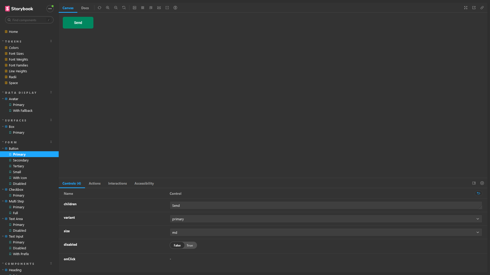

# Projeto 05 - Design System

> *O meu projeto publicado está [nesse outro repositório]().*

O quinto módulo da trilha atualizada de ReactJS do *bootcamp* Ignite da [Rocketseat](https://www.rocketseat.com.br/) faz uma introdução a Design Systems, ensinando como implementar e documentar um UI Kit baseado no sistema de design Andrômeda. React.js, Stitches, Storybook, turborepo e changesets são algumas das tecnologias utilizadas. O projeto é publicado no NPM e GitHub Pages.

O projeto original está disponível [neste repositório](https://github.com/rocketseat-education/05-design-system).

## Table of contents

- [Overview](#overview)
  - [The challenge](#the-challenge)
  - [Screenshot](#screenshot)
  - [Links](#links)
- [My process](#my-process)
  - [Built with](#built-with)
  - [What I learned](#what-i-learned)
  - [Questions](#questions)
  - [Useful resources](#useful-resources)
- [Author](#author)

## Overview

Uma parte do [sistema de design Andrômeda no Figma](https://andromeda.rocketseat.dev/) é abstraído no diretório `tokens` com Stitches. O diretório `react` é um UI Kit baseado nesse sistema de design, enquanto o `docs` contém a documentação em *stories* desse kit. Todos são projetos diferentes e, para evitar dependências desnecessárias, todos são alocados em um único `monorepo`.

O uso de um `monorepo` é recomendado em projetos que possuem várias partes interdependentes e que precisam ser mantidas em sincronia. Neste caso, o `monorepo` permite que as diferentes partes do projeto (tokens, UI kit e documentação) sejam desenvolvidas e atualizadas em conjunto, sem a necessidade de gerenciar dependências individuais. Isso reduz a complexidade do projeto e torna mais fácil manter a consistência visual em todo o sistema.

Sem o uso de um `monorepo`, a importação de recursos de um projeto em outro seria feita através de dependências individuais, como normalmente ocorre em projetos que não utilizam `monorepos`. Cada projeto seria publicado como um pacote separado, com suas próprias dependências e versões específicas, o que poderia levar a problemas de compatibilidade e dificuldades na hora de atualizar as diferentes partes do sistema.

### The challenge

1. Configurar o `monorepo`
2. Definir os *tokens* de design
3. Implementar os componentes em React
4. Documentar cada componente em *stories*
5. Publicar o UI Kit e o Storybook

### Screenshot

### Links

- [Remote repository]()

- [Live preview]()

## My process

### Built with

- Vite
- React.js
- Stitches
- Storybook
- Phosphor Icons
- Radix UI
- Turborepo
- changesets
- GitHub Actions
- NPM

### What I learned

#### [Storybook, my short summary.](./Storybook.md)

#### **Design System**

Um sistema de design é uma abordagem que padroniza os componentes de interface, incluindo a aparência, comportamento e interação do usuário em um conjunto de aplicativos de uma empresa. O objetivo de um sistema de design é manter a consistência visual e garantir que a experiência do usuário seja uniforme em todos os aplicativos, tornando mais fácil a navegação e interação com eles.

Para os desenvolvedores, os sistemas de design são úteis porque permitem que as equipes trabalhem de forma mais eficaz e eficiente, reduzindo o retrabalho e os prazos de entrega.

A implementação do sistema de design em programação envolve a tradução das diretrizes e valores definidos no design em código e na criação de uma biblioteca de estilos consistente para ser utilizada nos diferentes aplicativos da empresa.

#### **Monorepo**

A monorepo is a software development practice where all code for multiple projects is stored in a single repository. In the case of Ignite, the monorepo allows for the different parts of the project (tokens, UI kit, and documentation) to be developed and updated together, reducing the complexity of the project and making it easier to maintain consistency across the system.

Monorepos are a way of organizing code repositories that store multiple projects in a single repository. This can have several advantages over the traditional approach of having one repository per project, such as:

- Easier code sharing and reuse across projects
- Simplified dependency management and versioning
- Faster and more consistent builds and tests
- Improved collaboration and code review

However, monorepos also come with some challenges, such as:

- Increased complexity and size of the repository
- Potential performance issues and scalability limits
- Difficulty in enforcing code quality and security standards
- Higher learning curve and tooling requirements

#### **Turborepo**

Turborepo is a popular monorepo tool in the JavaScript/TypeScript ecosystem.

Using monorepos without the right tooling can make applications more difficult to manage than using polyrepos. To have an optimized monorepo, you’ll need a caching system along with optimized task execution to save development and deployment time.

#### **GitHub Actions**

GitHub Actions is a CI/CD platform.

You can create *workflows* that are triggered when *events* happen in your repository. Workflows contain one on more *jobs*, executed in a VM or container, in sequential or parallel order. Jobs have *steps* which run scripts or *actions*.

Workflows take place in `.github/workflows/name.yml` file

Events are specific activities, such as pull requests or pushes commit.

Jobs are a set of steps that are executed in order and dependent on each other. Each step is either a shell script or an action.

Workflows are written in YAML syntax

A workflow must contain the following basic components:

1. One or more *events* that will trigger the workflow.
2. One or more *jobs*, each of which will execute on a *runner* machine and run a series of one or more *steps*.
3. Each step can either run a script that you define or run an action, which is a reusable extension that can simplify your workflow

It is possible to the GitHub context to gain access to environment variables that stores sensitive data.

Jobs run in parallel by default. Creating dependent jobs is achieved by setting `needs: <job name>` in the job that needs to wait for the completion of the previous job.

It possible to cache dependencies using `actions/cache@v3`

### Questions

1. Por que `description story` não funciona com apenas uma `StoryObj` na versão 6.5?

### Useful resources

- [A Frontend Workshop Environment | Brad Frost](https://bradfrost.com/blog/post/a-frontend-workshop-environment/)

- [A Guide to Monorepos for Front-end Code | Toptal](https://www.toptal.com/front-end/guide-to-monorepos)

- [Building a full-stack TypeScript application with Turborepo - LogRocket Blog](https://blog.logrocket.com/build-full-stack-typescript-application-turborepo/)

## Author

- GitHub - [jvmdo](https://github.com/jvmdo)

- Frontend Mentor - [@jvmdo](https://www.frontendmentor.io/profile/jvmdo)

- CodeWars - [jvmdo](https://www.codewars.com/users/jvmdo)

- LinkedIn - [João Oliveira](https://www.linkedin.com/in/de-oliveira-joao/)
