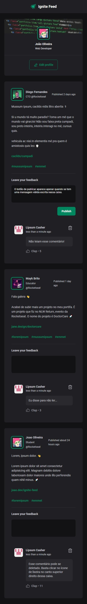
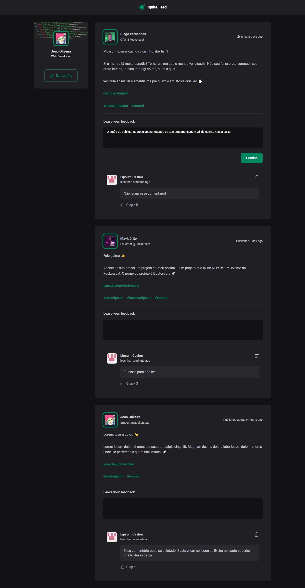

# Projeto 01 - Ignite Feed

No primeiro projeto do <em>bootcamp</em> Rocketseat Ignite, desenvolvi uma página responsiva a partir de um <em>design</em> Figma em que há postagens de usuários e funcionalidades de comentários em postagens, likes e remoção.

## Screenshots

|                                              Mobile                                              |                                              Desktop                                               |
| :----------------------------------------------------------------------------------------------: | :------------------------------------------------------------------------------------------------: |
|  |  |

## Live site preview

<!-- TODO -->

## O que eu aprendi

- Iniciar um projeto ReactJS utilizando Vite

  ```bash
    npm create vite@latest
  ```

- O que é e como utilizar componentes

- Como passar dados para componentes utilizando `props`

- Como aplicar CSS global

- Como aplicar CSS Modules

- Renderização condicional

- Como utilizar biblioteca de ícones e formatação de datas e horas

- Como mapear uma lista de dados para componentes

- O que é e para que serve a propriedade `key`

- Como utilizar variáveis de estado e `useState()`

- Como trocar dados entre componentes passando `callbacks` pelas suas `props`

- O elemento HTML `textarea` não possui atributo `pattern`

- Imutabilidade em React (ler mais)

  - Não se altera variáveis, cria-se outras pois é mais fácil para o React comparar seus valores e atualizar a apresentação

- Closures (ler mais)

  - Utilizar o valor atualizado de uma variável de estado logo após atualizar o seu valor? O valor utilizado será o antigo e não o atualizado como esperado.

    ```js
    const [counter, setCounter] = useState(0);
    setCounter(++counter);
    console.log(counter); // Expected: 1; Real value: 0;
    ```

    ```js
    // Solution #1: use another variable
    const otherCounter = counter + 1;
    setCounter(otherCounter);
    ```

    ```js
    // Solution #2: pass a callback to setCounter that holds the updated desired value
    setCounter((state) => {
      return state++;
    });
    setItems((state) => [...state, newItem]);
    ```

  - Quando se precisar atualizar uma variable de estado que depende de seu valor anterior, recomenda-se utilizar a solution #2.

## Dúvidas

- O escopo do modules não funcionou quando utilizei <em>tag selectors</em>. Tive que tornar o seletor mais específico colocando uma class na frente.

  ```css
  /* This rule affects all the components */
  span {
    display: block;
    margin: -2rem 1rem;
  }
  /* This rule affects only the sidebar component */
  .sidebar span {
    display: block;
    margin: -2rem 1rem;
  }
  ```

- Como utilizar várias classes no `className` para evitar repetir regras no CSS (como fiz no componente Avatar)? Ou se existe uma solução mais adequada, sem repetição de CSS.
