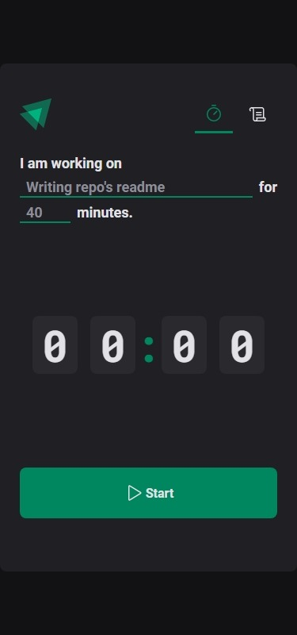
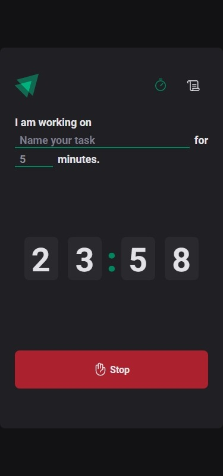
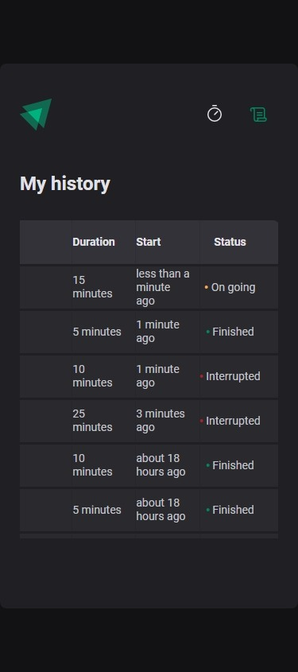
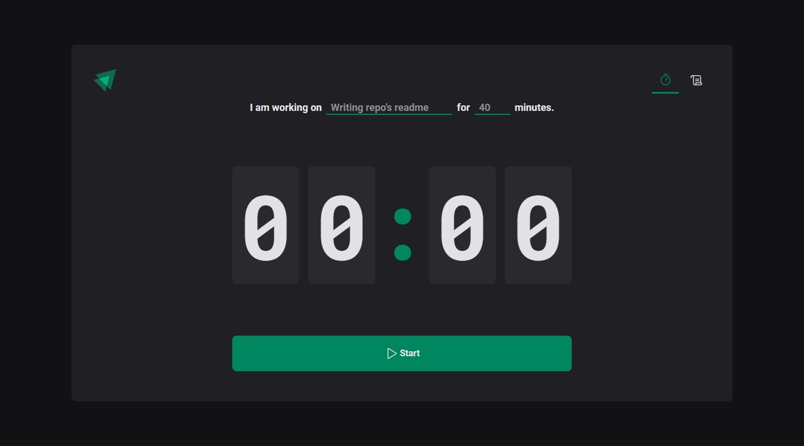
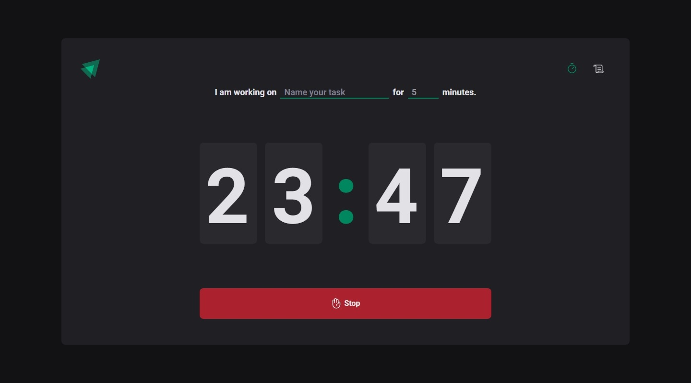
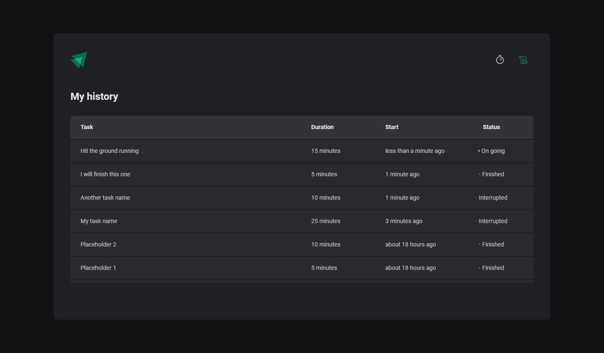
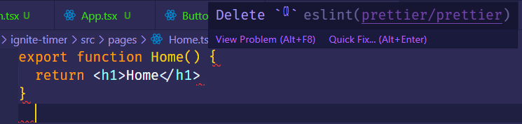

# Projeto 02 - Criando SPAs com React

O segundo módulo da trilha atualizada de ReactJS do *bootcamp* Ignite da [Rocketseat](https://www.rocketseat.com.br/) ensina como desenvolver uma aplicação completa aplicando diversos conceitos de React e de ferramentas do seu ecossistema. 

O projeto original está disponível [neste repositório](https://github.com/rocketseat-education/02-ignite-timer).

## Table of contents

- [Overview](#overview)
  - [The challenge](#the-challenge)
  - [Screenshot](#screenshot)
  - [Links](#links)
- [My process](#my-process)
  - [Built with](#built-with)
  - [What I learned](#what-i-learned)
  - [Questions](#questions)
  - [Problems and bugs](#problems-and-bugs)
  - [Useful resources](#useful-resources)
- [Author](#author)
- [Acknowledgments](#acknowledgments)


## Overview

Ignite Timer é o aplicativo desenvolvido neste módulo cuja funcionalidade principal é um relógio de contagem regressiva o qual o usuário pode escolher entre 5 e 60 minutos. Sua funcionalidade secundária é apresentar um histórico das contagens.

### The challenge

A proposta deste módulo é construir um aplicativo utilizando React e sua bibliotecas, seguindo a proposta de design disponibilizada [neste projeto Figma](https://www.figma.com/community/file/1127351821076435124). 

#### Design
  - Aplicar corretamente as fontes, cores, tamanhos, espaçamento, ícones e textos;
  - Botões devem reagir a ações de *hover over* e *focus*;
  - Botões e campos de entrada devem reagir ao estado de *disabled* do formulário e contagem regressiva em andamento;
  - Responsividade (entre 320px e 1440px).

#### Funcionalidades
  - Iniciar contagens regressivas;
  - Interromper contagens;
  - Navegação entre as páginas;
  - Apresentar histórico de contagens;
  - Indicar status da contagem no histórico;

### Screenshots

Capturas das telas do meu app finalizado para dispositivos mobile (375px) e desktop (1440px).

#### Mobile
| Mobile      | Mobile (with active states) | Mobile (page 2)     |
| :----:        |    :----:   |    :---: |
|       |        |    |


#### Desktop
| Desktop      | Desktop (with active states) | Desktop (page 2)     |
| :----:        |    :----:   |     :---: |
|       |        |    |

### Links
  - [Repositório do meu projeto](https://github.com/jvmdo/rocketseat-ignite/tree/main/reactjs/ignite-timer)

  - [Live demo on StackBlitz](https://stackblitz.com/github/jvmdo/rocketseat-ignite/tree/main/reactjs/ignite-timer?terminal=dev)

## My process

O meu processo de aprendizagem por vídeo-aulas instruídas é tomar nota de passos e conceitos importantes do código que está sendo apresentado e, no fim de cada seção, usar as anotações para escrever meu próprio código, consultando o mínimo possível o código-fonte da aula.

### Built with

Some of the technologies, libraries, tools, techniques, patterns, and concepts applied in this project.

#### Technologies, libraries and tools
  - Vite
  - ReactJS
  - TypeScript
  - Styled Components
  - React Router DOM
  - React Hook Form
  - Zod
  - Immer
  - date-fns
  - Phosphor React
  - Local Storage
  - ESLint

#### More
  - Mobile-first workflow
  - CSS custom properties
  - Flexbox
  - Styled Themes
  - React Layouts
  - React Contexts
  - React Reducers

### What I learned

- Estilização com Styled Components
  - ```npm i styled-components```
  - Adicionar extensão de definição de tipagem
    1. ```npm i @types/styled-components --save-dev```
    2. Criar arquivo ```src/@types/styled.d.ts```
    3. Escrever [esse código](src/@types/styled.d.ts).
  - Como escrever CSS-in-JS
    ```js
    export const StyledContainer = styled.tag`...`
    ```
  - Definir um arquivo de estilos globais que é importado dentro do ```<ThemeProvider>```
    ```js
    export const GlobalStyle = createGlobalStyle`...`
    ```
  - Definir arquivos de estilos para componentes
  - Como criar um arquivo de temas
    1. Criar um arquivo .ts com o nome do tema
    2. Exportar um objeto contendo as cores, tamanhos, etc.
    3. No App.tsx, embrulhar retorno com ```<ThemeProvider theme={themeName}>```
    4. Utilizar valores do tema
        ```jsx
        background-color: ${(props) => props.theme['green-500']};
        ```
  - Como reaproveitar classes de estilos em comum
    ```js
    export const StartButton = styled(CommonButton)`...`
    ```
  - Passar propriedades customizadas e mapeá-las para CSS utilizando ```keyof typeof <OBJECT>``` como foi feito [nesse código](src/pages/History/styles.ts).
  - Suporte nativo a pré-processador semelhante a SASS
  - É possível exportar mais de um styled componente em um mesmo arquivo. Assim dá para estilizar individualmente cada elemento HTML.

- ESLint
  - ```npm i eslint --save-dev```
  - Extender um conjunto de regras de terceiros:
    1. ```npm i @rocketseat;eslint-config -D```
    2. No arquivo .eslintrc.json, adicionar ```"extends": "@rocketseat/eslint-config/react",```
  - Definir npm script ```"lint": "eslint src --ext .ts,.tsx --fix"```
  - No settings.json do VS Code editor. ```codeActionsOnSave {source.fixAll.eslint: true}```

- React Router DOM
  - ```npm i react-router-dom```
  - Padrão para estruturação de páginas e seus componentes exclusivos.
    - pages/nome-da-page/components/../*.tsx,ts
    - pages/nome-da-page/index.tsx
    - pages/nome-da-page/styled.ts
  - Definir um arquivo de rotas src/Router.tsx
    - O roteamento é feito nesse componente, que retorna um ```<Routes>```, que, por sua vez, possui vários ```<Route path="/" element={<Page/>}/>``` com caminhos e páginas-alvo.
    - Importar ```<Router/>``` no App.tsx e embrulhá-lo num ```<BrowserRouter>```.
    - Para navegar, utiliza-se o componente ```<NavLink>``` no lugar de ```<a/>```.
    - NavLink adiciona uma classe ```active``` à rota ativa no momento, conveniente para CSS.

- React Layouts
  - React layouts evita repetição de instâncias de componentes pelas páginas do projeto.
  - Criar arquivos src/layouts/MyLayout/*index.tsx, styles.ts
  - No index.tsx, implementar o ```<MyLayout>``` que retorna a estrutura de componentes pelas páginas utilizando de ```<Outlet>```, que será substituído dinamicamente pelos componentes exclusivos de uma página.
  - Embrulhar todos os Route em Router.tsx com um 
    ```html
    <Route path="/" element={<MyLayout />}>
      // Route
      // Route
    </Route> 
    ```
- React Hook Form
  - ```npm i react-hook-form```
  - ```{register, handleSubmit, watch, formState} = useForm()```
  - ```register(inputName, options)``` é a função que retorna os métodos necessários para lidar com inputs. Deve-se invocá-la e desconstruir seu retorno no próprio elemento de input ```<input type="..." {...register(inputName)}>```
  - ```handleSubmit(callback)``` é passada no ```onSubmit``` do formulário. Esse ```callback``` é a função que o autor define para lidar com os inputs. Ela recebe um objeto de dados contendo todos os valores dos inputs na forma ```{inputName: value}```
  - ```watch(inputName)``` é a função que torna um input controlável. Assim, o autor tem acesso ao valor desse input em tempo real.
  - Contexto próprio com ```<FormProvider>```

- Zod
  - ```npm i zod```
  - Extensão para react-hook-form
    - ```npm i @hookform/resolvers```
    - ```import {zodResolver} from "@hookform/resolvers/zod"```
  - Processo
    1. Definir o schema, que é o formato dos dados retornado pelo formulário com restrições (validação);
    2. Definir type, ```type formData = zod.infer<typeof formDataSchema>;```
    3. Adicionar resolver ao react-hook-form
        ```js
        useForm<formData>({
          resolver: zodResolver(formDataSchema),
          defaultValues: { ... },
        })
        ```
- React Contexts
  - Context providers são componentes que, ao invés de serem mostrados em tela como de costume, eles fornecem um contexto (dados globais) para seus descendentes.
  - Eles resolvem o problema de *prop drilling*
  - Também resolvem o problema que ocorre quando as mesmas (e muitas) propriedades precisam ser passadas para vários descendentes.
  - Processo
    1. Criar arquivo src/contexts/MyContext.tsx
    2. Definir a interface MyContextProps, que contém as variáveis de estado e métodos que se deseja expor aos descendentes.
    3. Instanciar e exportar o contexto ```export const MyContext = createContext({} as MyContextProps)```. Os componentes que desejam ter acesso aos dados globais chamam ```const { ... } = useContext(MyContext)```
    4. Implementar o componente provedor ```export function MyContextProvider({ children }: MyContextProviderProps) {...}```, responsável por centralizar a aplicação das variáveis de estado e métodos
    5. Embrulhar o ```<Router/>``` com o componente de contexto no App.tsx

  - ```children``` é um ```ReactNode```. Deve-se usar uma interface para tal.
  - O código do arquivo MyContext.tsx deve ser independente de bibliotecas que não lidam diretamente com implementação de contextos.

- React Reducers
  - Alternativa ao ```useState()``` em componentes cuja variável de estado é complexa, há diferentes tipos de alterações possíveis nela e provenientes de diferentes ações do usuário. 
  - Capaz de combinar diversas variáveis de estado em uma maior composta.
  - Incentiva a separação do código do componente e seu código de gerenciamento de estado.
  - Processo
    1. Criar arquivo src/reducers/my-reducer.ts
    2. Implementar função responsável pelo gerenciamento de estado ```export function myReducer(state: MyState, action: MyActions) {...}```
    3. Chamar ```useReducer(myReducer, initialValues)``` em MyContextProvider
    4. Chamar ```dispatch()``` onde se usaria um setMyState()
    5. Criar e implementar um [arquivo de tipos de ações](src\reducers\actions.ts) para facilitar a escrita de código.

- Immer
  - ```npm i immer```
  - É uma biblioteca que auxilia o programador a lidar com imutabilidade em React. Com Immer, o autor pode modificar diretamente uma variável de estado sem quebrar as regras de imutabilidade.
  - Processo
    1. No arquivo my-reducer.ts ```import { produce } from 'immer'```
    2. Usar ```produce(state, draft => {...})``` onde há atualização de estados

- Local Storage
  - Para salvar dados, implementar um ```useEffect()``` cuja dependência é a variável que armazena os dados de interesse.
  - Para recuperar dados, implementar o código na função de inicialização do ```useReducer(_, __, (initialValues) => {...})``` (terceiro parâmetro). Deve-se atentar que a função deve sempre retornar um objeto no mesmo formato da variável de estado, mesmo que seja ```[initialValue]```.

- date-fns para formatar datas de forma relativa e altamente customizável.

#### Conceitos, dicas e mais

- ```useState()``` é um hook utilizado para criar variáveis de estado cujo objetivo é (re)renderizar a tela toda vez que seu valor é modificado.

- ```useEffect()``` (do termo side-effect) permite monitorar uma (ou mais) variável (de estado) e rodar uma função em resposta a alterações nela. Essa função também é executada na primeira renderização do componente. Se nenhuma variável for passada como dependência, então a função é executada apenas uma vez. 

  Uma outra função pode ser opcionalmente retornada. Nessa função, pode-se executar um código que “reseta” o que está sendo feito na função principal. Importante: raramente se utiliza de ```useEffect()``` para atualizar uma variável de estado em modo síncrono.

- Controlled vs Uncontrolled input fields. O primeiro refere-se a rastrear o valor do input em uma variável de estado através do atributo ```value={state}```. Um input sem ```value``` configurado é não controlável. Nesse caso, o React não tem acesso nem monitora em tempo real o input. Assim, recuperamos esse valor apenas quando ele for necessário utilizando DOM. A escolha entre um ou outro depende se a aplicação requer mais interação ou desempenho.

- ```as const``` vs ```Object.freeze({})```

- *Prop Drilling* em React ocorre quando há necessidade de passar propriedades de um parent para um child que estão distante na árvore de componentes. Assim, essas propriedades devem passar por todos os componentes filhos de parent (que geralmente não precisam delas) até alcançar child.

- Avoid passing all the setMyState() functions as props in the context. Create another function in the ancestral scope and pass it in the props

- Para testar rapidamente um parameter e evitar o fortíssimo TypeScript,  ```para: any``` resolve.

- Para mostrar em tela o conteúdo estruturado de um JSON, basta renderizar ```<pre>{JSON.stringify(data, null, 2)}</pre>```

- Quando repartir um componente em componentes menores?
  1. Uma parte da UI se repete várias vezes
  2. Uma parte do código de um componente é independente do restante (não significa que não precisa de comunicação via props)
  3. ...

- O seguinte hook cria uma variável que não é reiniciada quando há uma renderização da tela ```const tick = useRef({ intervalId: 0 })```.

### Questions

#### **Pergunta 01**. Por que a primeira execução do relógio do projeto original inicia exatamente no momento que o botão é pressionado enquanto no meu inicia com 1s de atraso?

  **Resposta 01**. 
  A lógica de contagem é diferente: a minha se baseia na quantidade de segundos para o final da contatem enquanto a deles, no total de segundos menos a quantidade de segundos que se passou desde o início da contagem.

  Daí, na minha lógica, quando a UI atualiza após 1 segundo por conta do ```setInterval```, já se passou 1 segundo; enquanto na dele, o valor inicial é o total de segundos menos os segundos passados (que no primeiro tick ainda é 0)e, após 1 segundo, há a subtração, gerando o comportamento normal de um cronômetro.

  ```jsx
  // Mine
  const activeTimerSeconds = activeTimerId ? secondsLeftToEnd : 0
  // Theirs
  const totalSeconds = activeCycle ? activeCycle.minutesAmount * 60 : 0
  const currentSeconds = activeCycle ? totalSeconds - amountSecondsPassed : 0
  ```

  Portanto, para contornar esse 1s de atraso, eu chamo uma atualização antes do ```setInterval()```
  ```js
  setSecondsLeftToEnd(currentActiveTimer.minutes * 60)
  ```


#### **Pergunta 02**. A linha comentada fere o princípio da imutabilidade?

  **Resposta 02**. 
  Apesar do fato de que outra lista é criada pelo método ```map()```, os elementos da lista são objetos que também serão modificados na lista fonte pois são parâmetros passados por referência. Portanto, a melhor prática é criar outro objeto.
  
  No entanto, o app funciona mesmo com a quebra da imutabilidade, já que a variável de estado não são os objetos e sim a lista que os contém. 

```jsx
setTimers((state) =>
  state.map((timer) => {
    if (timer.id === activeTimerId) {
      // timer.interruptedAt = Date.now()
      return { ...timer, interruptedAt = Date.now() } 
    }
    return timer
  }),
)
```

#### **Pergunta 03. Por que a página de histórico não atualiza em tempo real o status do Timer?**

Quando um timer está em contagem, seu estado no histórico é "On going". Quando o timer finaliza, seu estado é "Finished" porém para a tabela atualizar, deve-se navegar à pagina Home e voltar à History.

  **Resposta 03.**
  No projeto original, a contagem regressiva no título também não atualiza quando o app está na History. Um detalhe interessante é que, no meu projeto, escrevi um retorno no código do ```useEffect``` para restaurar o título original da página enquanto no projeto original esse retorno não existe. Isso leva a um comportamento diferente: no meu app, ao alternar para History, a contagem regressiva no título da página é substituída por "Ignite Timer" enquanto no app original a contagem simplesmente congela.

  ```js
    if (currentActiveTimer) {
      document.title = `Countdown ${minutesCountdownString}:${secondsCountdownString}`
    }
    return () => {
      document.title = 'Ignite Timer'
    }
  ```
  Portanto, acredito que os hooks de estado de uma página não são executadas enquanto o app está em outra página. Daí, concluo que, da maneira foi implementado, não tem como a página de histórico ser notificada de que o estado do Timer foi alterado, porque ele não é alterado até visitar a página do Timer.


#### **Pergunta 04. Se a conclusão da pergunta anterior é verdadeira, por que o Timer apresenta a contagem regressiva correta e atualizada quando o app retorna à Home? Se é incorreta, então como evitar o congelamento da contagem no título?**
  **Resposta 04.**
  Porque a função responsável pelos *ticks* do relógio é o *callback* executado pelo **setInterval**, o qual é disparado pelo **useEffect** que é disparado pela criação de uma nova contagem. Após isso, a sua execução é independente do hook.

  Esse fato reforça minha crença de que os hooks não são executados em segundo plano, porque, se fossem, o estado da quantidade de segundos seria atualizado, o que iria atualizar a renderização da contagem no título. Enfim, esse é exatamente o tipo de dúvida sanada ao se lê a documentação.

#### **Pergunta 05**. Por que, ao deixar e retornar à Home após iniciar uma contagem, o display apresenta, durante 1s, a quantidade total de minutos inicial?
  **Resposta 05.**
  Certamente esse comportamento é devido ao ```useEffect``` ser executado sempre que o app abre a página. O que leva à execução do hook:

  ```js
    setSecondsLeftToEnd(currentActiveTimer.minutes * 60)
  ```

### Problems and bugs

- ESLint problems

  **Problem**:

  

  **Solution found**. Add the following object inside ```rules``` in .eslintrc.json file
    ```json
    "prettier/prettier": [
      "error",
      {
        "endOfLine": "crlf"
      }
    ]
    ```
  **It solved the problem?**. No, I had to run ```npm run lint``` on every new file I created in this project. 
  
  I set ESLint as default formatter for *.tsx files,but Prettier is overtaking anyways.

  ```npm run lint --fix``` with flag is not working. However, it works properly if the flag is directly written in the npm script command.

- Styled Components

  Set the input's width within nested rules did not work. But when I changed to styled component inheritance it worked fine.


### Useful resources

- [About immutability](https://immerjs.github.io/immer/). See also [this script](./map-vs-reference.js).

- [About reducers](https://dmitripavlutin.com/react-usereducer/)

- [About controlled vs uncontrolled inputs](https://www.joshwcomeau.com/react/data-binding/)


## Author

- GitHub - [jvmdo](https://github.com/jvmdo)

- Frontend Mentor - [@jvmdo](https://www.frontendmentor.io/profile/jvmdo)

- CodeWars - [jvmdo](https://www.codewars.com/users/jvmdo)

- LinkedIn - [João Oliveira](https://br.linkedin.com/)