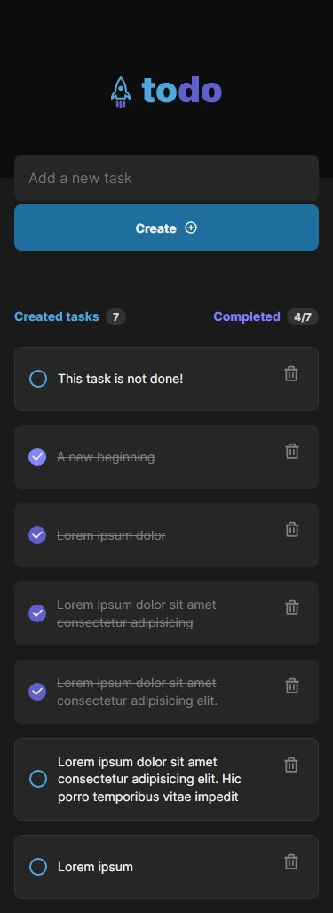

# Rocketseat Ignite - Desafio 01

Esta é a minha solução para o primeiro desafio da trilha ReactJS atualizada do Ignite.

## Table of contents

- [Overview](#overview)
  - [The challenge](#the-challenge)
  - [Screenshot](#screenshot)
  - [Links](#links)
- [My process](#my-process)
  - [Built with](#built-with)
  - [What I learned](#what-i-learned)
  - [Questions](#questions)

## Overview

### The challenge

Nesse desafio, deve-se desenvolver uma aplicação de controle de tarefas no estilo **to-do list**, que segue as seguintes exigências:

- Design

  - Seguir o _layout_ e estilo disponibilizados projeto de design
  - Alterar aparência de elementos em _hover_ e cliques

- Funcionalidades

  - Adicionar uma nova tarefa
  - Marcar e desmarcar uma tarefa como concluída
  - Remover uma tarefa da listagem
  - Mostrar o progresso de conclusão das tarefas

- Bônus
  - Responsividade

### Screenshot

#### Mobile

|                                              Mobile                                              |                                                Mobile (with active states)                                                 |
| :----------------------------------------------------------------------------------------------: | :------------------------------------------------------------------------------------------------------------------------: |
|  |  |

#### Desktop

|                                              Desktop                                               |                                                 Desktop (with active states)                                                 |
| :------------------------------------------------------------------------------------------------: | :--------------------------------------------------------------------------------------------------------------------------: |
|  |  |

### Links

- [Project GitHub's repository](https://www.github.com/jvmdo/rocketseat-ignite/reactjs/todo-list)

- [Live Site URL](https://todo-list-jvmdo.netlify.app/)

## My process

### Built with

- Vite
- Mobile-first workflow
- Semantic HTML5 markup
- CSS custom properties
- Flexbox
- ReactJS
- CSS Modules
- TypeScript

### What I learned

- Estados
- Imutabilidade do estado
- Mapear listas para componentes
- Componentes
- Propriedades
- Primeiros passos com TypeScript
- Como reutilizar classes com o `composes` do CSS Modules.
- Como utilizar e estilizar _checkboxes_.
- Crypto API para gerar UUIDv4 aleatório

### Questions

- Não sei se a forma que eu completo as tarefas esta correta. Talvez eu tenha violado o princípio da imutabilidade.

  Eu implementei essa função para atualizar a lista de ToDos utilizando o `useState()`. Ela é passada como _callback_ para o componente `Task` e, assim, tem acesso ao id da tarefa selecionada.

  Esta é uma boa e correta abordagem ou o próprio componente Task deveria lidar com o estado da tarefa?

  ```js
  function onToggleTask(taskId: string) {
    const newTasksState = tasks.map((task) => {
      if (task.id === taskId) {
        task.isDone = !task.isDone;
      }
      return task;
    });
    setTasks(newTasksState);
  }
  ```

   **RESPOSTA**

    Modificar um objeto, mesmo que dentro de um ```.map()```, altera o valor de suas propriedades modificadas no array fonte também. Portanto, a forma acima de fato fere a imutabilidade.

    ```js
      // Fixed!
      return { ...task, isDone: !task.isDone }
    ```

- Como passar a `TaskProps` junto de outros _callbacks_ para o componentes? Eu não encontrei uma solução, então tive que acrescentar funções à interface.

  ```ts
  export interface TaskProps {
    id: string;
    text: string;
    isDone: boolean;
    toggleDone?: (id: string) => void;
    deleteTask?: (id: string) => void;
  }
  ```

  Talvez a solução seja criar outra interface para os _callbacks_ e agregá-las (&) no componente?
